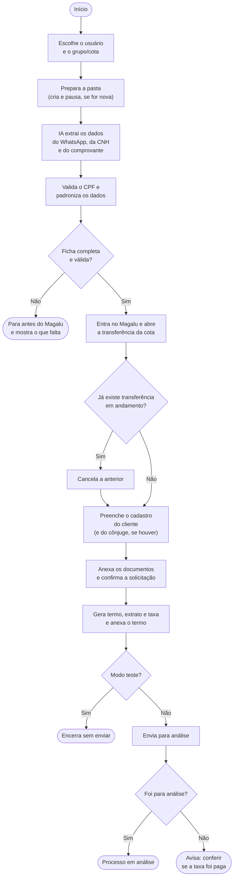

# Cadastro Magalu
Script em Python que organiza documentos de clientes e sobe processos de transferência de consórcio no sistema da Magalu.
Mas o que é esse processo de transferência? A resposta mais curta para isso seria: um cliente compra a cota de outra pessoa, e a administradora precisa do cadastro do novo titular, com documentos, para analisar a troca.
  


Áreas pixeladas escondem dados reais da cota usada no teste.
## O problema
No fluxo do meu trabalho (subir processos no sistema da Magalu), tenho um problema: esse fluxo é repetitivo, manual e tem risco de erro humano. Subir um processo no sistema da Magalu significa extrair os dados do cliente por meio dos documentos pessoais, escrevê-los nos formulários do sistema e anexar os arquivos para o processo ir para análise. Antes, todo esse processo era feito manualmente e demorava cerca de 20 a 30 minutos:
- Salvar os documentos recebidos em uma pasta na área de trabalho
- Abrir o sistema da Magalu e os documentos salvos
- Preencher os formulários de acordo com os documentos
- Baixar os documentos do processo
- Anexar os documentos
- Conferir se o processo foi para análise de fato

Hoje a história muda: leva cerca de 5 minutos, somando iniciar o script, salvar e renomear os documentos na pasta e toda a parte necessária no sistema da Magalu.
- O script cria a pasta do cliente
- Manda os documentos pessoais pela API da Anthropic: a IA lê os documentos e o texto do WhatsApp, com as informações que não constam nos documentos, como profissão, renda, telefone e e-mail
- Retorna todos os dados necessários para preencher o formulário
- Antes de entrar no sistema da Magalu, o script tem alguns cuidados:
  - Função que verifica se o CPF extraído é matematicamente válido; caso contrário, avisa o usuário
  - Portão: verifica se foram extraídos todos os dados necessários para iniciar o processo no sistema; caso contrário, para e avisa o usuário do que está faltando
- Abre sozinho o sistema, preenche o formulário e anexa os documentos, avisando o usuário do que está acontecendo nos momentos necessários
- Baixa o termo de transferência (contrato), o extrato da cota e o boleto da taxa do processo, e salva tudo na pasta do cliente que o script criou
- Envia o processo para análise, anexando o termo que foi salvo
- Verifica se o processo realmente foi para análise e avisa o usuário

## Como funciona


## Como rodar

*Sem credenciais reais no sistema da Magalu não é possível rodar o script, nem no modo teste.*

### Requisitos

- Python 3 instalado
- Credenciais de representante cadastradas no sistema da Magalu
- Chave da API da Anthropic

### Instalação

```
pip install -r requirements.txt
playwright install chromium
```

O arquivo `profissoes_magalu.json` precisa estar na pasta do projeto (já vem no repositório). Ele tem a lista de profissões cadastradas no Magalu, e a IA usa essa lista para escolher uma profissão que existe no sistema.

### Configuração do .env

Crie um arquivo `.env` na pasta do projeto com as variáveis abaixo:

```
# Chave da API da Anthropic
ANTHROPIC_API_KEY=

# Pasta onde o script cria as pastas dos processos (no Windows, coloque o caminho entre aspas simples)
PASTA_TRABALHO=

# Credenciais de cada conta da Magalu: um bloco por conta, com o nome da conta como prefixo
REPRESENTANTE_FILIAL=
REPRESENTANTE_CHAPA=
REPRESENTANTE_SENHA=

# Modo teste: CPF de gerador, grupo e cota usados nos testes
CPF_TESTE=
GRUPO_TESTE=
COTA_TESTE=
```

O script roda para mais de uma conta da Magalu. Para cada conta, além das variáveis no `.env`, é preciso adicionar uma entrada no dicionário `usuarios`, no topo do `main.py`. O nome da entrada, em letras minúsculas, é o que você digita quando o script pergunta a conta:

```python
usuarios = {
    "representante": {
        "chapa": os.getenv("REPRESENTANTE_CHAPA"),
        "senha_magalu": os.getenv("REPRESENTANTE_SENHA"),
        "filial": os.getenv("REPRESENTANTE_FILIAL")
    }
}
```

### Organização da pasta

Para cada processo, o script cria a pasta `{grupo}_{cota}` dentro da `PASTA_TRABALHO`, com a subpasta `Documentos` e o arquivo `texto_whats.txt`, e pausa para você salvar os documentos:

- Documentos com dados pessoais (CNH ou RG) devem ser renomeados para `cnh`
- Documentos com dados de endereço devem ser renomeados para `endereco`
- A `cnh` e o `endereco` precisam estar em PDF, PNG ou JPG; outros formatos, como HEIC (comum em fotos de iPhone), não são aceitos
- Se um documento tiver mais de um arquivo, como o verso da CNH, o segundo pode se chamar `cnh2`: ele será anexado, mas não será lido pela IA
- Documentos para comprovação de estado civil devem ser renomeados para `certidao`
- Documentos para comprovação de renda não precisam ser renomeados, **mas todos os arquivos que sobrarem na pasta, exceto o `.txt`, serão anexados como renda**
- No `texto_whats.txt`, coloque os dados do cliente que não aparecem nos documentos: profissão, renda, telefone, e-mail, estado civil, sexo e, se houver, os dados do cônjuge

### Modo teste

No topo do `main.py`, a variável `MODO_TESTE` define como o script roda: `True` roda como teste e `False` roda como processo real. No modo teste, o script usa o CPF (você pode utilizar um gerador de CPF), o grupo e a cota definidos no `.env` (`CPF_TESTE`, `GRUPO_TESTE` e `COTA_TESTE`), e para antes do "Concluir", então nada é enviado para análise.

O modo teste ainda preenche a solicitação no sistema real e cancela uma solicitação que esteja em andamento nessa cota. Por isso, use um grupo e uma cota que possam ser usados para teste.

### Rodar

```
python main.py
```

O script pergunta de qual conta da Magalu é a cota e, fora do modo teste, o grupo e a cota.

## Decisões## Decisões

### Portão antes de abrir o sistema

Antes de abrir o sistema da Magalu, o script confere se todos os dados obrigatórios foram extraídos. Se faltar algum, ele para e avisa o que está faltando. Os parceiros nem sempre mandam a documentação completa, e descobrir isso no meio do preenchimento me obrigaria a deixar o sistema aberto esperando a resposta, com risco de a sessão expirar. Parar antes não custa nada.

### Dois modelos: Haiku e Sonnet

O texto do WhatsApp (`texto_whats.txt`) é lido pelo Haiku, que é mais barato e acerta bem esse tipo de texto. Os documentos são lidos pelo Sonnet: nos testes, ele acertou todos os documentos, inclusive os de qualidade ruim, enquanto o Haiku errou CPF e data de nascimento. Mesmo com o Sonnet, o CPF extraído continua passando pela verificação matemática.

### A IA extrai, o código normaliza

A IA lê os dados, mas o formato final que o sistema exige é garantido pelo código:

- **Telefone:** o código mantém só os números, remove o DDD e confere se sobraram 8 ou 9 dígitos. Em um cadastro, a IA alterou o número e ele chegou com 7 dígitos; agora o script para e avisa antes de abrir o sistema.
- **Número do endereço:** o código fica só com o primeiro valor antes do primeiro espaço. A IA juntava o complemento ao número, o que quebrava a busca do endereço no sistema e fazia o complemento sumir.
- **Estado civil:** o código remove o "(a)", passa tudo para minúsculas e trata os acentos (ã, á, ú). Assim, a forma feminina e a masculina caem no mesmo código do sistema.

### Modo teste

O sistema da Magalu não tem ambiente de teste. Por isso, o modo teste usa o CPF, o grupo e a cota definidos no `.env` e para antes do "Concluir", sem enviar nada para análise.

## Uso de IA

### Como parte do produto

A IA lê o texto do WhatsApp colocado no `texto_whats.txt` (Haiku 4.5), extrai os dados dos documentos (Sonnet 5) e devolve tudo em JSON. Os pontos que o código reforça são o portão e o tratamento de número, telefone, estado civil, sexo e CPF. Os pontos que não são reforçados pelo código, o usuário confere no console.

### Como ferramenta de ajuda no desenvolvimento

Explicação de conceitos novos, revisão de código e de commits, e depuração em dupla (a IA propunha hipóteses, e eu rodava os experimentos no sistema real da Magalu). Também usei a IA para debater ideias e viabilidade, ajudar nas decisões do projeto e listar prioridades para seguir com ele, mas quem batia o martelo era sempre eu. Tudo isso foi feito com o Claude, num projeto em que criei uma skill voltada para me ajudar a criar projetos com o intuito de aprender, além de documentos que guardam o contexto das tecnologias que eu sei e as ideias de projetos.

Alguns trechos que eram apenas mecânicos, ou que não traziam ganho de aprendizado (trechos que eu saberia fazer, só levaria tempo), eu deleguei para a IA escrever no meu padrão de escrita e lógica: eu especificava e depois revisava e testava. Alguns exemplos:

- Fusão de três scripts, `teste_playwright.py`, `termo.py` e `main.py` (trecho mecânico)
- Bloco de tratamento do telefone (sem aprendizado novo): eu já sabia a lógica e a sintaxe necessárias e deleguei para a IA escrever com base nisso

Acréscimos que fortaleceram o projeto, que eu analisei e aprovei. Exemplos:

- A ideia do `MODO_TESTE`
- Varredura do histórico do Git atrás de dados sensíveis
- O diagrama foi montado pela IA a partir da lista de passos que eu escrevi, e eu revisei

### Formatação e português

Usei a IA para analisar, formatar e revisar este README e os commits.

### Onde não entrou

- Mapeamento das telas do sistema da Magalu (codegen, DevTools, Inspector)
- Testes no sistema real

### Como foi conferido

- Modo teste no sistema real da Magalu
- Testes isolados no console com dados fictícios
- Linha que a IA escreveu e eu não sei explicar volta para eu escrever

